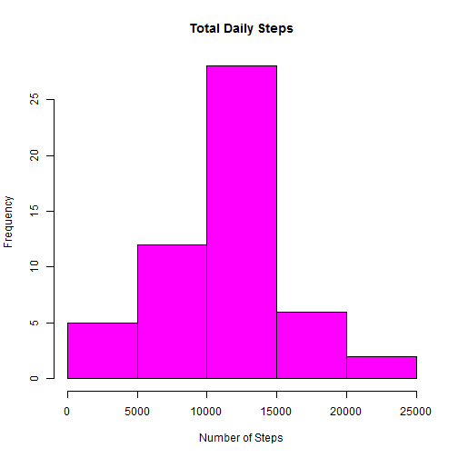
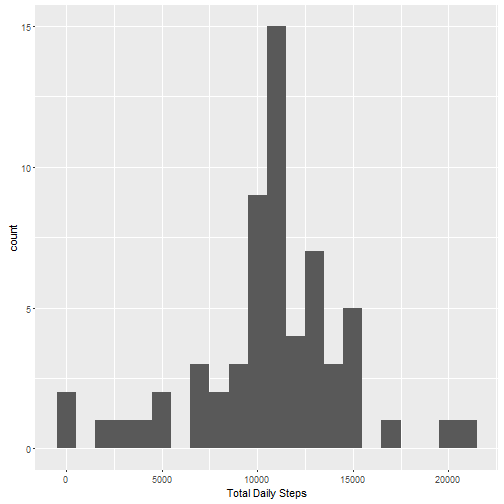
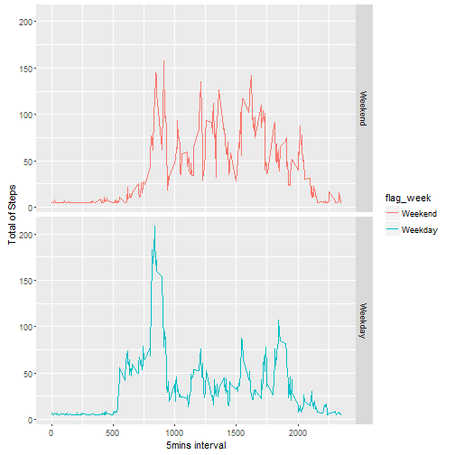

This is an R Markdown document for Peer-graded Assesment Project Course 1. 


```r
#*******************************************************#
# Author: F Almah S                                     #
# Module 5 | PA Course Project 1                        #
# Date: 24.10.16                                        # 
#*******************************************************#

# set working directory
setwd("C:/Users/tm35082/Desktop/New files/Cousera/Module5/Week2")

#set the library
library(ggplot2)
library(knitr)

# unzip and load data from local directory
unzip(zipfile="activity.zip")
data <- read.csv("activity.csv")

#data checking
head(data)
```

```
##   steps       date interval
## 1    NA 2012-10-01        0
## 2    NA 2012-10-01        5
## 3    NA 2012-10-01       10
## 4    NA 2012-10-01       15
## 5    NA 2012-10-01       20
## 6    NA 2012-10-01       25
```

```r
#-------------------------------------------------------------------
```


# Q1: What is mean total number of steps taken per day?
## 1. Calculate the total number of steps taken per day
## 2. If you do not understand the difference between a histogram 
##    and a barplot, research the difference between them. 
##    Make a histogram of the total number of steps taken each day
## 3. Calculate and report the mean and median of the total number of steps taken per day


```r
day.steps <- aggregate(steps ~ date, data, sum)

#prepare the .png file first
#png("stepsdaily.png", width=480, height=480)

hist(day.steps$steps, main = paste("Total Daily Steps"), col="magenta", xlab="Number of Steps")
```



```r
mean(day.steps$steps, na.rm=TRUE)
```

```
## [1] 10766.19
```

```r
median(day.steps$steps, na.rm=TRUE)
```

```
## [1] 10765
```

```r
#> mean(day.steps$steps, na.rm=TRUE)
#[1] 10766.19
#> median(day.steps$steps, na.rm=TRUE)
#[1] 10765

#-------------------------------------------------------------------
```


# Q2: What is the average daily activity pattern?
## 1. Make a time series plot (i.e. type = "l") of the 5-minute interval (x-axis) 
##    and the average number of steps taken, averaged across all days (y-axis)
## 2. Which 5-minute interval, on average across all the days in the dataset, 
##    contains the maximum number of steps?


```r
avg.steps <- aggregate(x=list(steps=data$steps), by=list(interval=data$interval),
             FUN=mean, na.rm=TRUE)

#prepare the .png file first
#png("avg5mins.png", width=480, height=480)

ggplot(data=avg.steps, aes(x=interval, y=steps)) +
  geom_line() +
  xlab("5mins interval") +
  ylab("Average Steps Taken")
```


```r
avg.steps[which.max(avg.steps$steps),]
```

```
##     interval    steps
## 104      835 206.1698
```

```r
#> avg.steps[which.max(avg.steps$steps),]
#interval    steps
#104      835 206.1698

#-------------------------------------------------------------------
```

# Q3. Imputing step.missing values

## Note that there are a number of days/intervals where there are 
## step.missing values (coded as NA). The presence of step.missing days may introduce 
## bias into some calculations or summaries of the data.

## 1. Calculate and report the total number of step.missing values in the dataset 
##   (i.e. the total number of rows with NAs)
## 2. Devise a strategy for filling in all of the step.missing values in the dataset. 
##    The strategy does not need to be sophisticated. For example, you could use the 
##    mean/median for that day, or the mean for that 5-minute interval, etc.
## 3. Create a new dataset that is equal to the original dataset but with the step.missing data filled in.
## 4. Make a histogram of the total number of steps taken each day and Calculate 
##    and report the mean and median total number of steps taken per day. Do these values 
##    differ from the estimates from the first part of the assignment? What is the impact 
##    of imputing step.missing data on the estimates of the total daily number of steps?


```r
# get the missing data for steps
step.missing <- is.na(data$steps)
# tabulate the output
table(step.missing)
```

```
## step.missing
## FALSE  TRUE 
## 15264  2304
```

```r
#> table(step.missing)
#step.missing
#FALSE  TRUE 
#15264  2304 
##->> meaning, out of 17,568 obs, total missing data is 2,304 

# Find the null positions so that later I can replace the value with the mean
step.miss.pos <- which(is.na(data$steps))

#get the length of missing "steps"
total.step.miss <- length(step.miss.pos)
#checking..
total.step.miss
```

```
## [1] 2304
```

```r
# > total.step.miss
#[1] 2304
##->> confirming the total missing values of "steps" is 2,304 (same as total TRUE above)

# simple imputation - create a vector to replicate the mean of steps 
# the idea is to create the mean value of "steps" with similar length of
# the missing values - used the positions to find the num of row
step.med.rep <- rep(mean(data$steps, na.rm=TRUE), times=total.step.miss)

# impute using mean: fill up the NAs with the mean vector (into the column "steps")
data[step.miss.pos, "steps"] <- step.med.rep

#checking...
head(data)
```

```
##     steps       date interval
## 1 37.3826 2012-10-01        0
## 2 37.3826 2012-10-01        5
## 3 37.3826 2012-10-01       10
## 4 37.3826 2012-10-01       15
## 5 37.3826 2012-10-01       20
## 6 37.3826 2012-10-01       25
```

```r
# > head(data)
# steps       date interval
# 1 37.3826 2012-10-01        0
# 2 37.3826 2012-10-01        5
# 3 37.3826 2012-10-01       10
# 4 37.3826 2012-10-01       15
# 5 37.3826 2012-10-01       20
# 6 37.3826 2012-10-01       25
##->> the output shows the NAs are replaced with the "steps" mean value i.e. 37.3826

day.steps <- tapply(data$steps, data$date, FUN=sum)

#prepare the .png file first
#png("stepsdaily2.png", width=480, height=480)

qplot(day.steps, binwidth=1000, xlab="Total Daily Steps")
```



```r
mean(day.steps)
```

```
## [1] 10766.19
```

```r
median(day.steps)
```

```
## [1] 10766.19
```

```r
#> mean(day.steps)
#[1] 10581.01
#> median(day.steps)
#[1] 10395
```

# Q4: Are there differences in activity patterns between weekdays and weekends?

## For this part the weekdays() function may be of some help here. 
## Use the dataset with the filled-in missing values for this part.

## Create a new factor variable in the dataset with two levels - "weekday" and "weekend" 
## indicating whether a given date is a weekday or weekend day.
## Make a panel plot containing a time series plot (i.e. type = "l") 
## of the 5-minute interval (x-axis) and the average number of steps taken, 
## averaged across all weekday days or weekend days (y-axis). See the README file in the GitHub repository to see an example of what this plot should look like using simulated data.


```r
data$date <- as.Date(data$date)
#create a vector of weekdays
step.weekday <- c('Monday', 'Tuesday', 'Wednesday', 'Thursday', 'Friday')

#Create a bew factor variable to specify the levels of week: weekday & weekend
data$flag_week <- factor((weekdays(data$date) %in% step.weekday), 
                   levels=c(FALSE, TRUE), labels=c('Weekend', 'Weekday'))

avg.steps.week <- aggregate(steps ~ interval + flag_week, data=data, mean)
#checking...
#> head(avg.steps.week)
#interval   flag_week    steps
#1        0   Weekend 4.672825
#2        5   Weekend 4.672825
#3       10   Weekend 4.672825
#4       15   Weekend 4.672825
#5       20   Weekend 4.672825
#6       25   Weekend 7.922825
##->> the output as shown above
## ------------------------------------------------------------------------
#avg.steps <- aggregate(steps ~ interval + day, data=filled.data, mean)

#prepare the .png file first
#png("avg5mins2.png", width=480, height=480)

#use ggplot to plot it beautifully
ggplot(avg.steps.week, aes(interval, steps)) + 
  geom_line(aes(colour=flag_week, group=flag_week)) + 
  facet_grid(flag_week ~ .) +
  xlab("5mins interval") + 
  ylab("Total of Steps")
```



